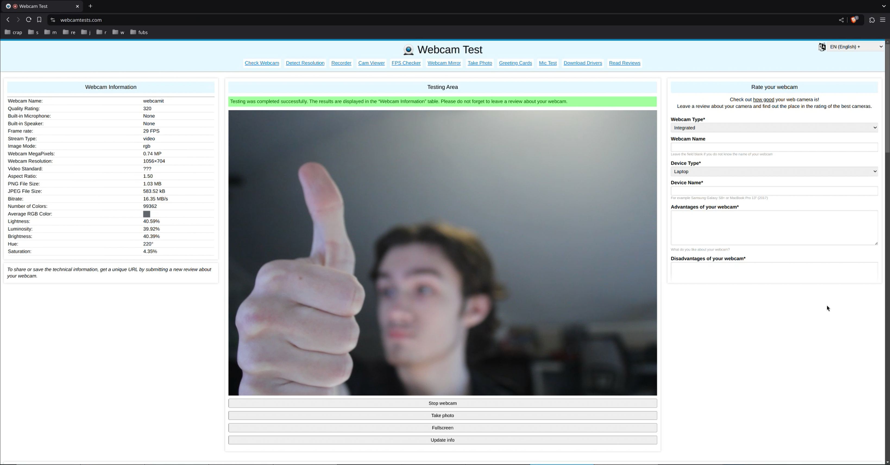

# webcamit
A linux daemon that automatically sets up and handles PTP cameras as video devices through v4l2.

This is meant to be a Linux equivelant to the EOS Webcam Utility driver. Ideally it will be a 'just works'
solution that does everything automatically.

- [x] Working basic webcam with ffmpeg
- [x] Listen to USB events and connect to a camera if found
- [ ] Monitor processes that use the v4l2 device and pause/end PTP thread if there are none
- [ ] Support more than one camera
- [ ] Automatically handle v4l2 options if needed
- [ ] UI with options to change camera settings while webcam is active

